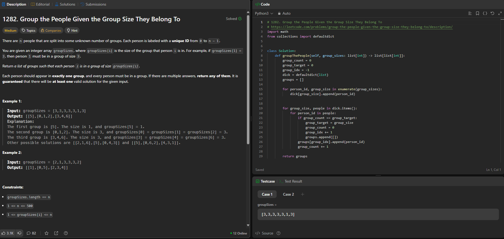
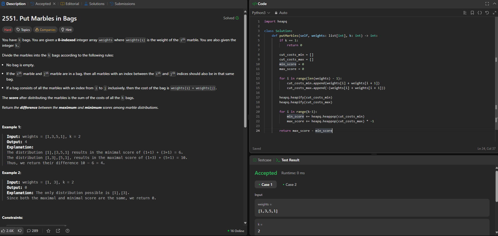

# Greed_Leet

**Conteúdo da Disciplina**: Algoritimos Ambiciosos<br>

## Alunos
|Matrícula | Aluno |
| -- | -- |
| 211031744  |  Júlio César Costa |
| 211031403  |  Marcus Vinicius Cunha Dantas |

## Sobre 
Este projeto visa resolver questões do leetcode relacionadas a algoritimos ambiciosos(greedy) com dificuldades médias e difíceis

| Problema | Nome                                   | Dificuldade |
|----------|----------------------------------------|-------------|
| 1282      | [Group the People Given the Group Size They Belong To](https://leetcode.com/problems/group-the-people-given-the-group-size-they-belong-to/description/)                        | Médio       |
| 2551     | [Put Marbles in Bags](https://leetcode.com/problems/put-marbles-in-bags/description/)                        | Difícil     |
| -     | []()                        | Médio       |
| -     | []()                        | Difícil     |

## Apresentação

[Apresentação no Youtube]()

## Screenshots

### [Group the People Given the Group Size They Belong To](https://leetcode.com/problems/group-the-people-given-the-group-size-they-belong-to/description/)



### [Put Marbles in Bags](https://leetcode.com/problems/put-marbles-in-bags/description/)



### []()


### []()


## Instalação
### Pré Requisitos
Python3.12+
### Comandos
#### Clonagem do Repositório
```git clone https://github.com/projeto-de-algoritmos-2025/Greed_Leet.git```
#### Execução
```cd ./Greed_Leet```<br>
```python3 [NOME-ARQUIVO].py```


